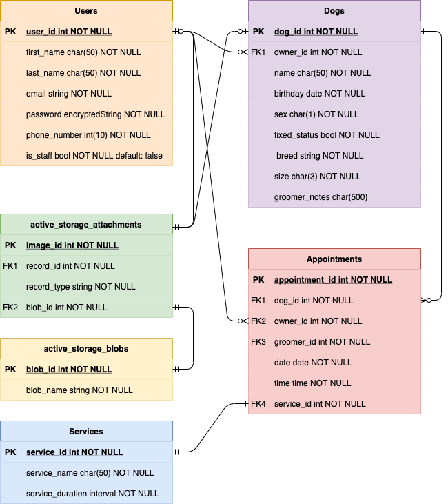
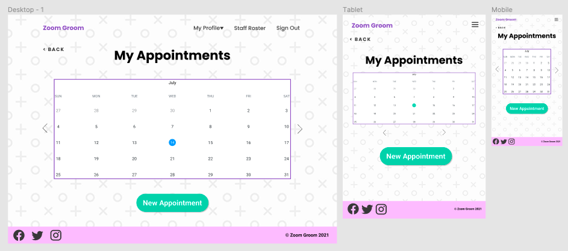
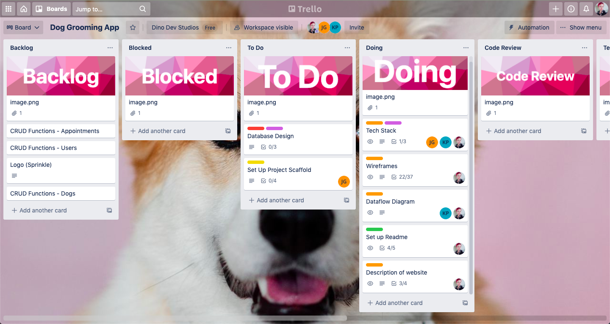

# Zoom Groom

## About
**Zoom Groom** is a booking system for Zoom Groom salon to track grooming bookings on both the business and user sides. Ideally, we would like to expand this in future to be a booking system to facilitate multiple businesses in a SaaS model.

## Functionality & Features
Zoom Groom has several core features designed to make life easier for you and your four-legged friend:
- Registration means you can save all of your essential details to the site to make booking your next appointment fast and painless
- Use your account to add a profile for each of your pets and save essential information such as their name, age, breed and any special requirements your groomer might need to know about. You can also add multiple pets on your profile
- The booking platform can be used by the grooming salon to organise appointments on a daily basis and allow management of appointments for multiple staff members
- On the business side, Zoom Groom allows managers to keep track of which groomers are available each day - this means that if a client has a preferred groomer for their dog, they are able to see which days that groomer is available.
- Client and groomers can both view bookings online via their accounts in an easy-to-read format

## Target Audience
Zoom Groom is designed to be a platform for both dog owners and dog groomers to use. This versatility is enabled by the fact that both parties use the same booking system logic. Ideally, we would like to make this scalable to be used by multiple businesses, but the current model is designed to be used by a single dog grooming business and its clients.

## Tech Stack

The front end of Zoom Groom will be built using TypeScript and the [React Framework](https://reactjs.org/). Additionally, we will be using the [MaterialUI](https://material-ui.com/) components library for consistent, clean and accessible styling. The calendar functionality will be built off of the [React Calendar](https://www.npmjs.com/package/react-calendar) NPM package. Unit testing on the client side will be done with [Jest](https://jestjs.io/), as well as manual testing by an end user in the deployed web app. 

Our back-end will be handled using [Ruby On Rails](https://rubyonrails.org/) in API mode, which will store our data for our customers, groomers, dogs, and appointments. For cloud storage of images uploaded by users, we will utilise [Cloudinary](https://cloudinary.com/?utm_source=google&utm_medium=cpc&utm_campaign=Rbrand&utm_content=492438439811&utm_term=cloudinary&gclid=Cj0KCQjwub-HBhCyARIsAPctr7w4UVA1_FttvY5MM9HH9vcO1B6366nN-pl_9QRWB579NCjopDaCTGMaAr6gEALw_wcB). Unit testing will be done using the [Rspec](https://github.com/rspec/rspec) gem.

The final live web app will have the client deployed to [Netlify](https://www.netlify.com/) and the back end deployed to [Heroku](https://id.heroku.com/login).

### Libraries

A number of libraries were used in the production of this application to make building and testing both ends as smooth as possible, and reducing spaghetti code in some areas.

The calls to the back end of our app are made using 'axios', which allows us to create an instance of our api (found in config/api.jsx) which we can then reference each time we need to make a request. Additionally, the syntax axios provides is much cleaner than the syntax that fetch requests use.

Because we are using JWTs as a form of user authentication, we have utilised 'jwt-decode' to import a function for decoding the JWT and allowing us to pull a user ID from it. This, in turn, lets us make an axios call using the ID from the JWT to find the matching user, and render content appropriately, such as the user's dogs.

Having a visual indicator of load state is crucial to being able to show users that our app is processing their requests, such as when they are logging in. By using the 'svg-loaders-react' library, we were able to quickly and easily import an engaging loading indicator that we then attached to our load states for requests to the API. This saved us from having to write out extra CSS and streamlined the process of confirming a load state in a visually appealing way.

For testing our front end, we have used Jest as well as the React Testing Library. Additionally, by using 'jest-dom', we can also access additional matcher methods designed with React testing in mind. Using these libraries together allows for the testing of React components by virtually rendering DOM nodes and using Jest assertations to test their render conditions.

Our tests on the back end are written using the 'rspec' gem. This testing library is being used in place of the default 'minitest' gem due to our familiarity writing tests in rspec. Testing with this gem pertains to the database and the CRUD functionality of our API's models.

## Dataflow Diagram

## Application Architecture Diagram

## Entity Relationship Diagram

## User Stories

### Business Owner Stories
- As a business owner I want to be able to view my business' calender so that I can see all of the current and past bookings
- As a business owner I want to be able to add and remove staff members so that I can have a record of current staff
- As a business owner I want to be able to add and remove staff on different days and edit their available times so that customers can then book with those staff members
- As a business owner I want to edit the opening days and hours of the business so that customers can view available dates

### Business Owner Sprinkles
- As a business owner I want to see statistics on my clients such as how long average time between appointments, lists of customers that are not returning etc. so that I can best manage my business.
- As a business owner I want to see statistics on my workers so that I can best manage my team.
- As a business owner I want to be able to edit pet attributes such as length of their bookings so that I can optimise the number of bookings that will fit in a day

### Groomer Stories
- As a groomer I want to be able to view my calender so that I know what work I have to complete that day.
- As a groomer I want to make notes on a customer or pet file so that I have a record of their past appointments and can keep comments or warnings without the customer having access to these notes.
- As a groomer I want to view a customer file so I can look at notes and details of the pet that is booked.
- As a groomer I want to move appointments so I can edit my calender if required
- As a groomer I want to be able to add blocks or breaks in my day so a customer cannot book at certain times for example lunch or if I am leaving early.

### Groomer Story Sprinkles
- As a groomer I want to be able to limit the number of certain dog types each day, for example only one large dog per day
- As a groomer I want to split bookings with my bather if I am working as part of a team so that I can have more available time in my calender.

### Customer Stories
- As a customer, I want to to sign up with my details so that I can use the system and log in.
- As a customer I want to view and update my details so I can keep them up to date.
- As a customer, I want to store my pet's details on my profile so that I don't need to re-enter them when I book.
- As a customer I want to to view all relative available appointment's for my pet so that I can choose the best appointment time.
- As a customer I want to view all my past and future appointments so that I can know when my previous appointments were and when my future appointments are coming up.
- As a customer I want to be able to edit my appointments so that I can change or remove them if I need to.

### Customer Story Sprinkles
- As a customer I want to be able to pay for my appointments ahead of time so I can save time on the day of the appointment

### Site Map

## Wireframes

### Landing Page

### Sign Up Page

### Log In Page

### User Profile Page

### Edit User Profile Page

### My Appointments Page

### Appointment Details Page

### New Appointment Page

### User Pets Page

### Pet Details

### Edit Pet

### Add Pet

### Staff Roster

## Trello

You can find the link to the project board [here](https://trello.com/b/NAcI5WoQ/dog-grooming-app)

### Updates

#### July 10 2021

.png)

#### July 12 2021

.png)

#### July 16 2021

.png)

#### July 19 2021

.png)

#### July 29 2021

.png)

