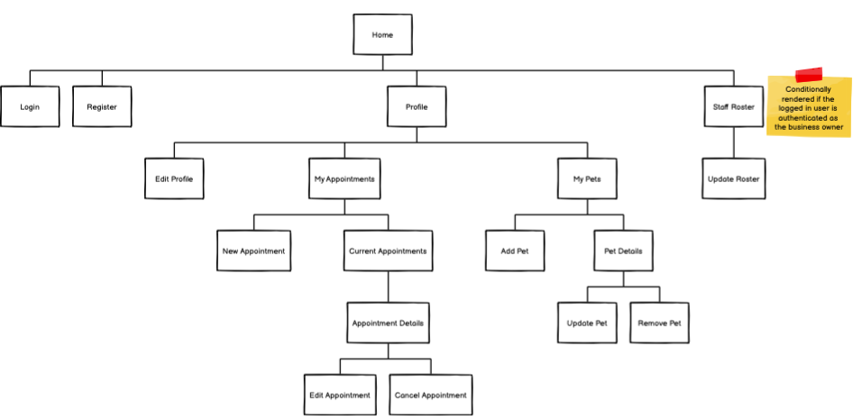

# Zoom Groom

## About
**Zoom Groom** is a booking system that takes the complexity out of handling your dog's next grooming session. It allows both dog owners and dog groomers to set up profiles and track their appointments. Users can also save details of each of their pets to avoid filling out extra forms on repeat bookings.

## Functionality & Features
Zoom Groom has several core features designed to make life easier for you and your four-legged friend:
- Registration means you can save all of your essential details to the site to make booking your next appointment fast and painless
- Use your account to add a profile for each of your pets and save essential information such as their name, age, breed and any special requirements your groomer might need to know about. You can also add multiple pets on your profile
- Groomers can use Zoom Groom's booking platform as well - organise your appointments and avoid those messy double-booking situations
- View all of your bookings online via your account in an easy-to-read format

## Target Audience
Zoom Groom is designed to be a platform for both dog owners and dog groomers to use. This versatility is enabled by the fact that both parties use the same booking system logic. Ideally, we would like to make this scalable to be used by businesses, but the current model is designed to be used by groomers who are working as sole traders or at small businesses/sole traders.

Zoom Groom caters to anyone who has a dog that needs grooming! Notice that we have used the term "pets" instead of "dogs" - this is to allow the app to potentially cater to other types of animals in future.

Currently, the scope of the audience is **Australia only**.

## Tech Stack

To Be Decided

## Dataflow Diagram

To Be Added

## Application Architecture Diagram

## User Stories

To Be Added

## Wireframes

### Site Map

To Be Added

## Trello

You can find the link to the project board [here](https://trello.com/b/NAcI5WoQ/dog-grooming-app)

### Updates

#### July 10 2021

.png)
