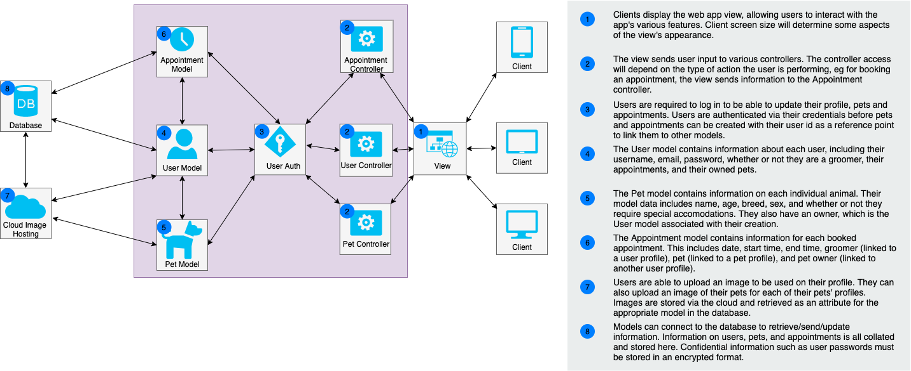

# Zoom Groom

## About
**Zoom Groom** is a booking system that takes the complexity out of handling your dog's next grooming session. It allows both dog owners and dog groomers to set up profiles and track their appointments. Users can also save details of each of their pets to avoid filling out extra forms on repeat bookings.

## Functionality & Features
Zoom Groom has several core features designed to make life easier for you and your four-legged friend:
- Registration means you can save all of your essential details to the site to make booking your next appointment fast and painless
- Use your account to add a profile for each of your pets and save essential information such as their name, age, breed and any special requirements your groomer might need to know about. You can also add multiple pets on your profile
- Groomers can use Zoom Groom's booking platform as well - organise your appointments and avoid those messy double-booking situations
- View all of your bookings online via your account in an easy-to-read format

## Target Audience
Zoom Groom is designed to be a platform for both dog owners and dog groomers to use. This versatility is enabled by the fact that both parties use the same booking system logic. Ideally, we would like to make this scalable to be used by businesses, but the current model is designed to be used by groomers who are working as sole traders or at small businesses/sole traders.

Zoom Groom caters to anyone who has a dog that needs grooming! Notice that we have used the term "pets" instead of "dogs" - this is to allow the app to potentially cater to other types of animals in future.

Currently, the scope of the audience is **Australia only**.

## Tech Stack

To Be Decided

## Dataflow Diagram

To Be Added

## Application Architecture Diagram

## User Stories

### Business Owner Stories
- As a business owner I want to be able to view my business' calender so that I can see all of the current and past bookings
- As a business owner I want to be able to add and remove staff members so that I can have a record of current staff
- As a business owner I want to be able to add and remove staff on different days and edit their available times so that customers can then book with those staff members
- As a business owner I want to edit the opening days and hours of the business so that customers can view available dates

### Business Owner Sprinkles
- As a business owner I want to see statistics on my clients such as how long average time between appointments, lists of customers that are not returning etc. so that I can best manage my business.
- As a business owner I want to see statistics on my workers so that I can best manage my team.
- As a business owner I want to be able to edit pet attributes such as length of their bookings so that I can optimise the number of bookings that will fit in a day

### Groomer Stories
- As a groomer I want to be able to view my calender so that I know what work I have to complete that day.
- As a groomer I want to make notes on a customer or pet file so that I have a record of their past appointments and can keep comments or warnings without the customer having access to these notes.
- As a groomer I want to view a customer file so I can look at notes and details of the pet that is booked.
- As a groomer I want to move appointments so I can edit my calender if required
- As a groomer I want to be able to add blocks or breaks in my day so a customer cannot book at certain times for example lunch or if I am leaving early.

### Groomer Story Sprinkles
- As a groomer I want to be able to limit the number of certain dog types each day, for example only one large dog per day
- As a groomer I want to split bookings with my bather if I am working as part of a team so that I can have more available time in my calender.

### Customer Stories
- As a customer, I want to to sign up with my details so that I can use the system and log in.
- As a customer I want to view and update my details so I can keep them up to date.
- As a customer, I want to store my pet's details on my profile so that I don't need to re-enter them when I book.
- As a customer I want to to view all relative available appointment's for my pet so that I can choose the best appointment time.
- As a customer I want to view all my past and future appointments so that I can know when my previous appointments were and when my future appointments are coming up.
- As a customer I want to be able to edit my appointments so that I can change or remove them if I need to.

### Customer Story Sprinkles
- As a customer I want to be able to pay for my appointments ahead of time so I can save time on the day of the appointment

## Wireframes

### Site Map

To Be Added

## Trello

You can find the link to the project board [here](https://trello.com/b/NAcI5WoQ/dog-grooming-app)

### Updates

#### July 10 2021

.png)
